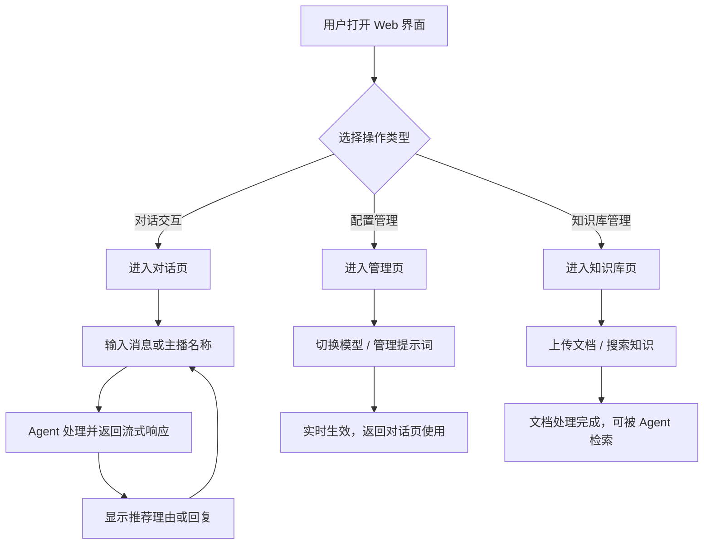

## 1. 产品概述

AI Agent 智能助手 Web 管理界面，为基于 LangGraph 的主播推荐 Agent 提供可视化操作平台。
- 目标用户：需要与 AI Agent 交互、管理模型配置、自定义提示词的技术运营人员
- 核心价值：通过直观的 Web 界面替代命令行操作，降低使用门槛，提升运营效率

## 2. 核心功能

### 2.1 功能模块
1. **智能对话页**：实时聊天、流式响应、主播推荐生成
2. **管理后台**：模型切换、系统提示词管理、自定义提示词管理
3. **知识库管理页**：文档上传、知识检索、状态查看

### 2.2 页面详情
| 页面名称 | 模块名称 | 功能描述 |
|---------|---------|---------|
| 对话页 | 聊天窗口 | 与 Agent 实时对话，支持流式 SSE 响应，显示消息历史和角色标识 |
| 对话页 | 推荐生成面板 | 侧边栏表单，输入主播名称、标签、偏好，一键生成推荐理由 |
| 对话页 | 状态栏 | 显示当前模型、系统提示词、对话轮次 |
| 管理页 | 模型管理 | 查看模型列表、切换当前模型、显示模型状态 |
| 管理页 | 系统提示词管理 | 查看、切换、创建、编辑、删除系统提示词，支持查看 .md 文件内容 |
| 管理页 | 自定义提示词管理 | 查看提示词模板列表、创建新模板、格式化预览 |
| 知识库页 | 文档上传 | 拖拽或点击上传 PDF/TXT/MD 文件到知识库 |
| 知识库页 | 知识搜索 | 输入查询文本，展示搜索结果和相似度 |
| 知识库页 | 状态概览 | 显示文档数量、集合名称、嵌入模型类型 |

## 3. 核心流程

## 4. 用户界面设计

### 4.1 设计风格
- **主色调**：深邃蓝黑 `#0f172a` 为主背景，靛蓝 `#6366f1` 为品牌色，青色 `#06b6d4` 为强调色
- **辅助色**：暖橙 `#f59e0b` 用于警告/高亮，玫红 `#ec4899` 用于特殊标记
- **按钮风格**：圆角 8px，带微光晕影，悬浮时亮度提升 20%
- **字体**：中文使用 Noto Sans SC，英文使用 JetBrains Mono（代码部分）
- **布局风格**：左侧固定导航（260px），右侧内容区自适应，卡片式布局
- **图标**：使用 Lucide 图标库，统一线性风格

### 4.2 页面设计概览

| 页面名称 | 模块名称 | UI 元素 |
|---------|---------|---------|
| 对话页 | 聊天窗口 | 消息气泡（圆角 12px）、头像标识、打字动画指示器 |
| 对话页 | 推荐面板 | 表单输入框、标签选择器、生成按钮（带加载状态） |
| 对话页 | 状态栏 | 徽章式标签、实时更新 |
| 管理页 | 模型卡片 | 卡片式布局、选中态高亮、切换按钮 |
| 管理页 | 提示词编辑器 | 代码编辑器风格、语法高亮、保存按钮 |
| 知识库页 | 上传区域 | 拖放区域（虚线边框）、文件列表、进度条 |
| 知识库页 | 搜索结果 | 列表式布局、内容摘要、相似度分数 |

### 4.3 响应式设计
- 桌面优先设计，最小宽度 1024px
- 管理页和知识库页在 768px 以下切换为两列布局
- 导航栏在移动端折叠为汉堡菜单
- 所有按钮和交互元素支持键盘操作

## 5. 非功能需求
- 页面前端使用 Vite + React 构建，Tailwind CSS 样式
- API 调用基于 Fetch API，流式响应使用 EventSource
- 页面切换使用 React Router，无刷新导航
- 所有 API 调用带加载状态和错误处理