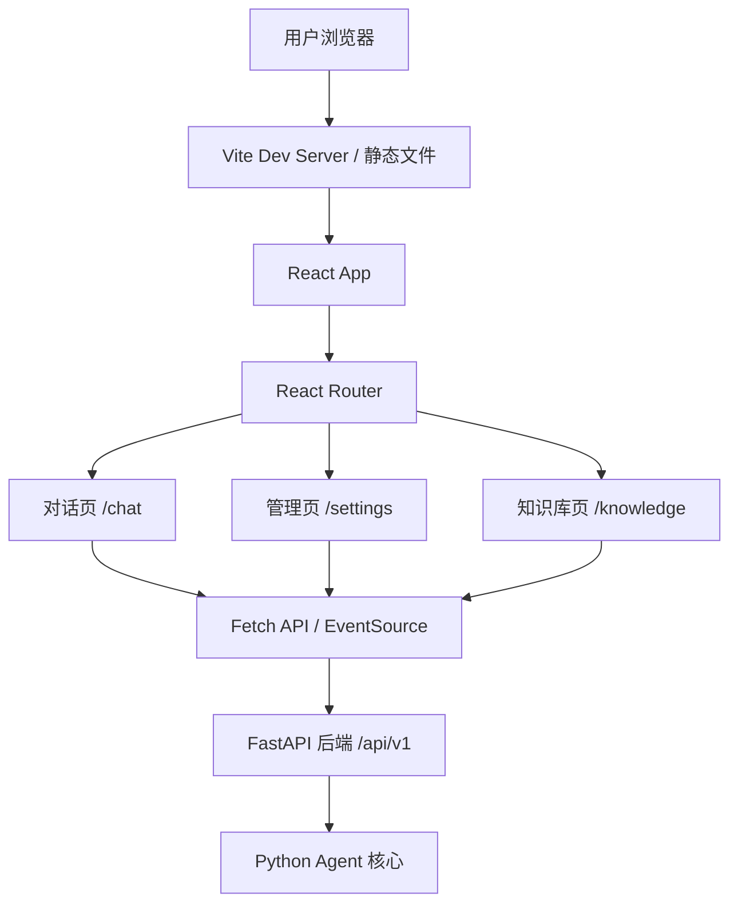

## 1. 架构设计



## 2. 技术选型

- **前端框架**: React 18 + TypeScript
- **构建工具**: Vite 5
- **样式方案**: Tailwind CSS 3
- **路由方案**: React Router 6
- **图标库**: Lucide React
- **HTTP 客户端**: 原生 Fetch API + EventSource（SSE）
- **初始化方式**: Vite 初始化

## 3. 路由定义

| 路由 | 页面名称 | 说明 |
|------|---------|------|
| `/` | 对话页 | 主聊天界面，默认页面 |
| `/settings` | 管理页 | 模型、系统提示词、自定义提示词管理 |
| `/knowledge` | 知识库页 | 文档上传、搜索、状态查看 |

## 4. API 接口对接

### 4.1 类型定义

```typescript
interface ChatRequest {
  message: string;
  streamer_name?: string;
  user_preferences?: string;
}

interface ChatResponse {
  reply: string;
  conversation_id: string;
}

interface GenerateRequest {
  streamer_name: string;
  tags?: string;
  content?: string;
  preferences?: string;
}

interface GenerateResponse {
  streamer_name: string;
  recommendation: string;
  sources: string[];
}

interface ModelInfo {
  name: string;
  display_name: string;
  is_current: boolean;
}

interface SystemPromptInfo {
  name: string;
  description: string;
  category: string;
  is_current: boolean;
}

interface SystemPromptContent {
  name: string;
  content: string;
  file_path: string;
}

interface KnowledgeStatus {
  document_count: number;
  collection_name: string;
  persist_directory: string;
  embedding_model: string;
}

interface KnowledgeSearchResult {
  content: string;
  metadata: Record<string, unknown>;
  score: number | null;
}

interface AgentStatus {
  current_model: string;
  available_models: string[];
  current_system_prompt: string;
  conversation_length: number;
  knowledge_base_count: number;
}
```

### 4.2 请求/响应格式

| 端点 | 方法 | 请求体 | 响应体 |
|------|------|--------|--------|
| `/api/v1/chat` | POST | `ChatRequest` | `ChatResponse` |
| `/api/v1/chat/stream` | POST | `ChatRequest` | SSE 流 |
| `/api/v1/generate` | POST | `GenerateRequest` | `GenerateResponse` |
| `/api/v1/generate/stream` | POST | `GenerateRequest` | SSE 流 |
| `/api/v1/models` | GET | - | `{ models: ModelInfo[], current: string }` |
| `/api/v1/models/switch` | POST | `{ model_type: string }` | `ModelInfo` |
| `/api/v1/system-prompts` | GET | - | `{ prompts: SystemPromptInfo[], current: string }` |
| `/api/v1/status` | GET | - | `AgentStatus` |
| `/api/v1/knowledge/status` | GET | - | `KnowledgeStatus` |
| `/api/v1/knowledge/search` | POST | `{ query: string, k?: number }` | `{ results: KnowledgeSearchResult[] }` |
| `/api/v1/history` | GET | - | `{ messages: { role: string, content: string }[] }` |
| `/api/v1/memory/clear` | POST | - | `{ message: string }` |
| `/api/v1/knowledge/upload` | POST | `FormData: file` | `{ file_name, document_ids, chunk_count }` |

## 5. 组件设计

| 组件名 | 类型 | 功能说明 |
|--------|------|---------|
| `Layout` | 布局 | 左侧导航 + 右侧内容区，自适应高度 |
| `Sidebar` | 导航 | 包含 Logo、页面切换、状态信息 |
| `ChatView` | 页面 | 消息列表 + 输入框 + 推荐面板 |
| `MessageList` | 组件 | 聊天消息列表，自动滚动到底部 |
| `MessageBubble` | 组件 | 单条消息（用户/AI），带头像和时间戳 |
| `ChatInput` | 组件 | 多行输入框 + 发送按钮 + 快捷键 |
| `StreamerPanel` | 组件 | 侧边栏推荐表单，折叠/展开 |
| `SettingsView` | 页面 | Tab 切换：模型、系统提示词、自定义提示词 |
| `ModelCard` | 组件 | 单个模型卡片，点击切换 |
| `SystemPromptList` | 组件 | 系统提示词列表，增删改查 |
| `PromptEditor` | 组件 | 提示词内容编辑框 |
| `KnowledgeView` | 页面 | 上传区 + 搜索区 + 状态面板 |
| `FileUploader` | 组件 | 拖拽上传区域 |
| `SearchResults` | 组件 | 搜索结果列表 |
| `StatusBar` | 组件 | 状态信息条 |
| `LoadingSpinner` | 通用 | 加载动画 |
| `Toast` | 通用 | 操作反馈提示 |